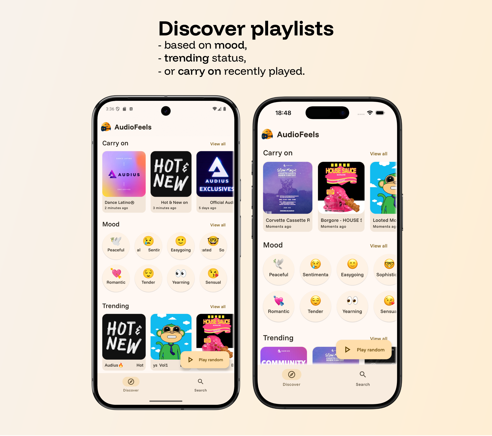
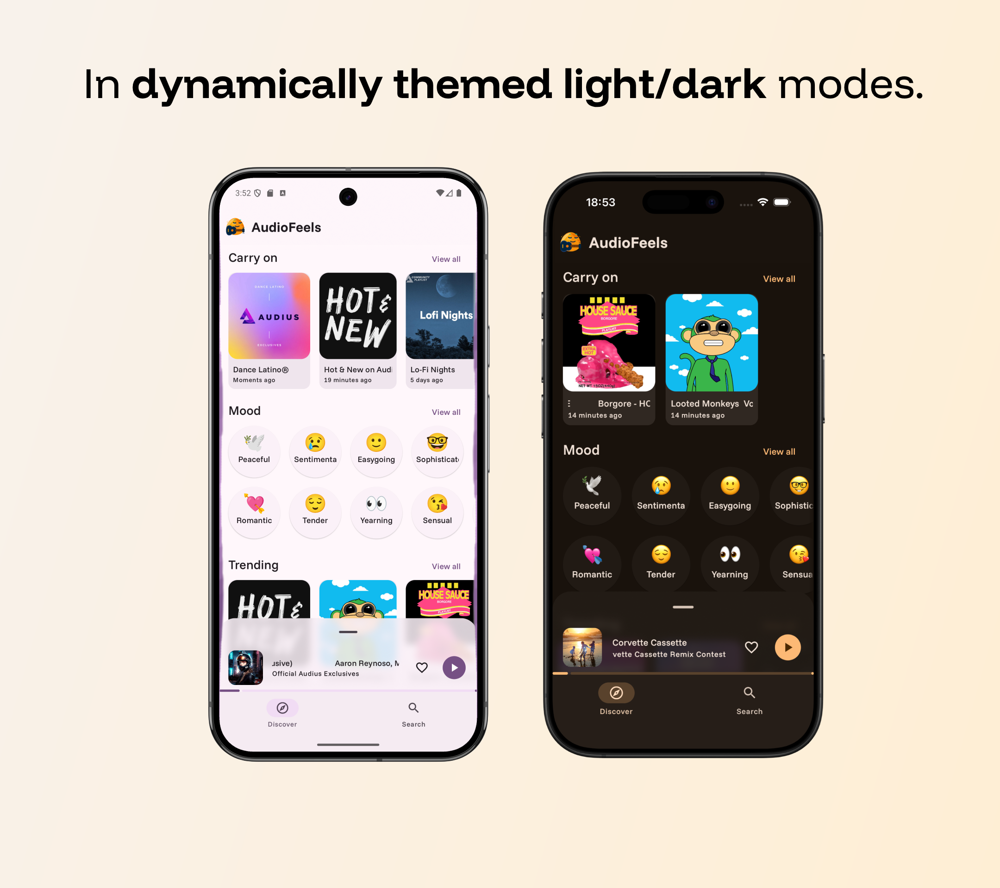

## About
**_AudioFeels_** is a **Compose Multiplatform** audio player for [Audius](https://audius.co/), built for simple, **mood-based playlist matching**.

    
Table of Contents

    <ol>
        <li><a href="#screenshots">Screenshots</a></li>
        <li><a href="#features">Features</a></li>
        <li><a href="#used-technologies">Used technologies</a></li>
    </ol>

## Screenshots

## Features
- **Playlist discovery** based on 
  - mood
  - trending status
  - text search
- **Carry on** playback
- **Responsive audio player**
- Track-based **dynamic theme**
- Live **audio visualization** on android

## Used technologies
- [Jetpack Navigation (aka "Navigation 2")](https://developer.android.com/jetpack/androidx/releases/navigation) - screen flows definition, backstack management
- [Room](https://developer.android.com/jetpack/androidx/releases/room) - database for on-device playlist/search suggestion storage
- [Datastore](https://developer.android.com/jetpack/androidx/releases/datastore) - user preference storage
- [Kotlin-inject](https://github.com/evant/kotlin-inject) - dependency injection
- [Ktor](https://ktor.io/) - network requests
- [Coroutines](https://kotlinlang.org/docs/coroutines-guide.html) - asynchronous/concurrent programming
- [Haze](https://github.com/chrisbanes/haze) - background blurring
